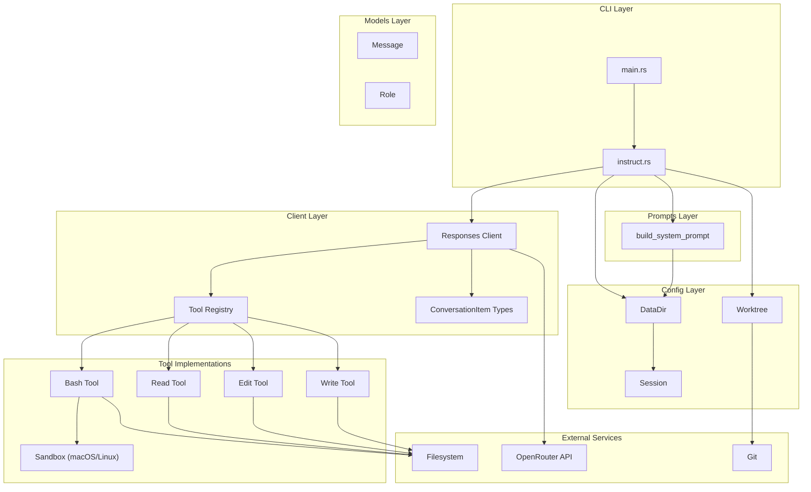
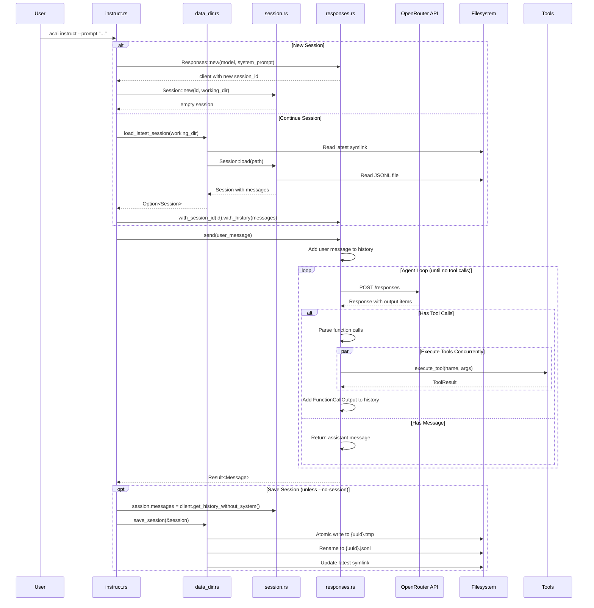
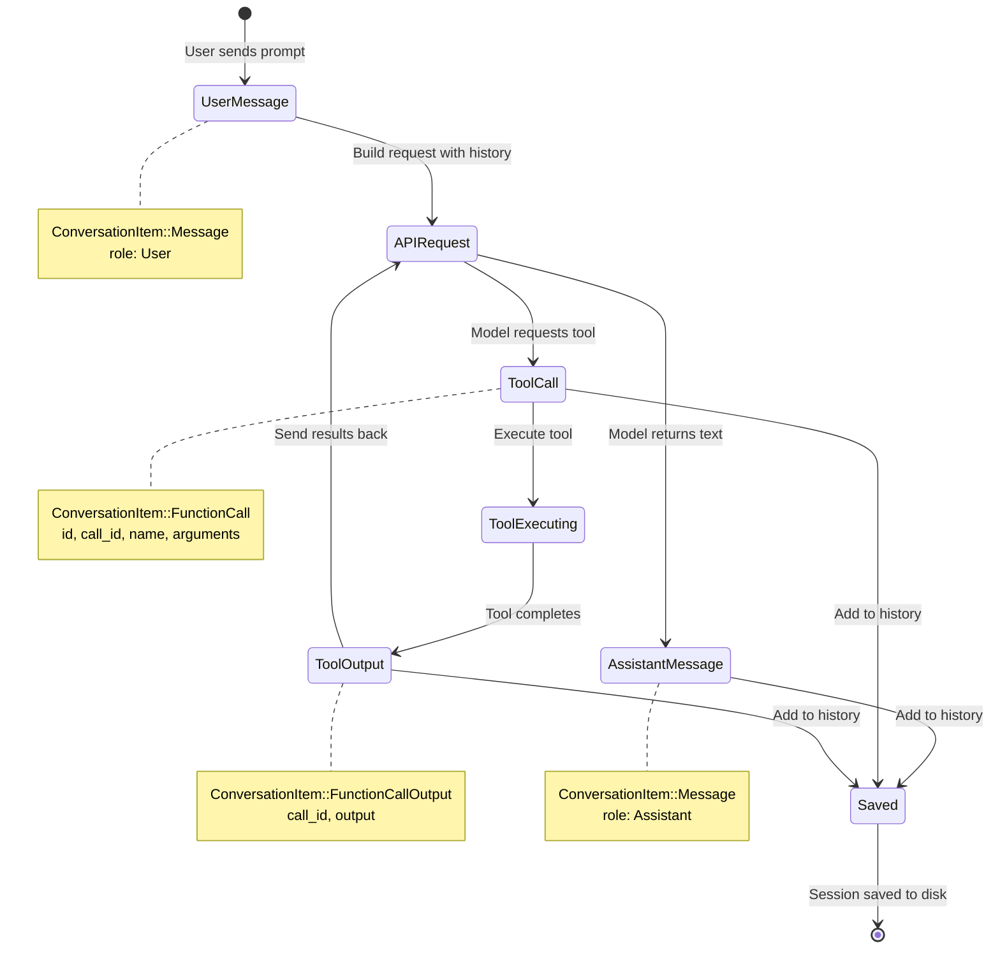
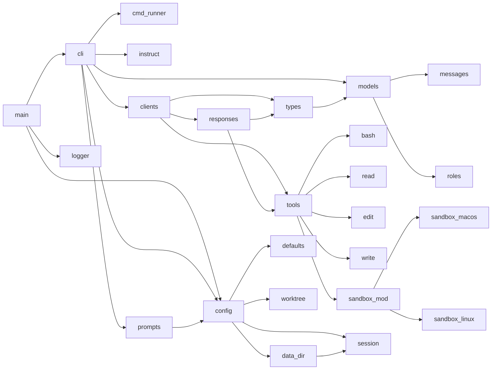

# Acai Architecture

Acai is an AI coding assistant CLI that integrates with language models via the OpenRouter API. It provides a conversation-based interface with tool execution capabilities for file manipulation, code editing, and shell command execution.

## Project Structure

```
acai/
├── src/
│   ├── main.rs              # Application entry point and CLI dispatch
│   ├── logger.rs            # Logging configuration (log4rs)
│   ├── cli/                 # Command-line interface layer
│   │   ├── mod.rs           # CLI module exports
│   │   ├── cmd_runner.rs    # Command runner trait
│   │   └── cmds/            # Individual commands
│   │       ├── mod.rs       # Command module exports
│   │       └── instruct.rs  # Main instruct command implementation
│   ├── clients/             # API client implementations
│   │   ├── mod.rs           # Client module exports
│   │   ├── responses.rs     # OpenRouter Responses API client
│   │   ├── types.rs         # API DTOs and ConversationItem enum
│   │   └── tools/           # Tool definitions and execution
│   │       ├── mod.rs       # Tool registry and execution
│   │       ├── bash.rs      # Bash command execution tool
│   │       ├── edit.rs      # File editing tool
│   │       ├── read.rs      # File reading tool
│   │       ├── write.rs     # File writing tool
│   │       └── sandbox/     # OS-level sandboxing
│   │           ├── mod.rs   # Sandbox configuration
│   │           ├── macos.rs # macOS sandbox-exec
│   │           └── linux.rs # Linux Landlock LSM
│   ├── config/              # Configuration and data management
│   │   ├── mod.rs           # Config module exports
│   │   ├── data_dir.rs      # Data directory and session storage
│   │   ├── session.rs       # Session persistence (JSONL)
│   │   ├── defaults.rs      # Default model and providers
│   │   └── worktree.rs      # Git worktree utilities
│   ├── models/              # Core data models
│   │   ├── mod.rs           # Models module exports
│   │   ├── messages.rs      # Message struct
│   │   └── roles.rs         # Role enum (User, Assistant, System, Tool)
│   └── prompts/             # System prompt generation
│       └── mod.rs           # Prompt builder with AGENTS.md support
├── docs/                    # Documentation
│   ├── session-management.md
│   ├── responses-api.md
│   ├── streaming-json-output.md
│   ├── logging.md
│   └── sandbox.md
├── Cargo.toml             # Package manifest
├── AGENTS.md              # Project instructions for AI
└── README.md              # User documentation
```

## Module Layering

The codebase follows a strict layered architecture with clear dependency boundaries:

```
┌─────────────────────────────────────────┐
│  Layer 4: cli                           │
│  - Command parsing (clap)               │
│  - Argument validation                  │
│  - Command dispatch                     │
├─────────────────────────────────────────┤
│  Layer 3: clients                       │
│  - API communication                    │
│  - Tool orchestration                   │
│  - Response streaming                   │
├─────────────────────────────────────────┤
│  Layer 2: config, models, prompts       │
│  - Data persistence                     │
│  - Core types                           │
│  - Prompt generation                    │
├─────────────────────────────────────────┤
│  Layer 1: Foundation                    │
│  - logger                               │
│  - External crates (anyhow, tokio, ...) │
└─────────────────────────────────────────┘
```

### Allowed Dependency Directions

Dependencies flow **downward only**:

```
cli → clients → config/models/prompts
      clients → tools → sandbox
cli/cmds → config, clients, models, prompts
```

**Cross-layer dependencies are prohibited:**
- `clients` **cannot** import from `cli`
- `config` **cannot** import from `clients`
- `models` **cannot** import from `clients` or `config`

**Allowed intra-layer imports:**
- `clients::tools` can use `clients::types`
- `config::session` can use `config::data_dir`

**Crate-level imports:**
All internal imports use absolute paths: `crate::module::Item`

## File Descriptions

### Entry Point

**`src/main.rs`**
- Application entry point
- CLI argument parsing using clap derive macros
- Subcommand dispatch (currently only `instruct`)
- Logger initialization with quiet mode detection for streaming JSON output
- Determines if quiet logging should be used based on output format

### CLI Layer

**`src/cli/mod.rs`**
- Re-exports from `cmd_runner` and `cmds`

**`src/cli/cmd_runner.rs`**
- `CmdRunner` trait: single `async fn run(&self, data_dir: &DataDir) -> anyhow::Result<()>`
- All CLI commands implement this trait for consistent execution

**`src/cli/cmds/mod.rs`**
- Re-exports `instruct` module

**`src/cli/cmds/instruct.rs`**
- Main command implementation for `acai instruct`
- Handles all CLI flags: `--prompt`, `--model`, `--continue`, `--resume`, `--fork`, `--no-session`, `--worktree`, `--output-format`, `--providers`
- Builds client and session based on flags (new, continue, resume, fork)
- Sets up git worktree if requested
- Reads AGENTS.md files and builds system prompt
- Manages the conversation lifecycle: send message → handle response → save session
- Validates mutually exclusive flags
- Supports streaming JSON output mode

### Clients Layer

**`src/clients/mod.rs`**
- Re-exports `Responses` client, `ConversationItem` type, and `tools` module

**`src/clients/responses.rs`**
- Main API client for OpenRouter's Responses API
- Builder pattern for configuration (model, temperature, max_tokens, providers)
- Agent loop: sends requests, handles tool calls, executes tools concurrently, continues until no more tool calls
- Retry logic with exponential backoff for transient errors (429, 500, 503)
- Streaming JSON output support with callbacks
- Usage tracking across multiple API calls
- Session restoration support (`with_session_id`, `with_history`)
- Conversation history management with typed items

**`src/clients/types.rs`**
- `ConversationItem` enum: the core conversation representation
  - `Message`: user/assistant/system/tool messages
  - `FunctionCall`: tool invocation from model
  - `FunctionCallOutput`: tool execution result
  - `Reasoning`: intermediate reasoning from reasoning models
- API request/response DTOs with serde derives
- Usage tracking types (`Usage`, `InputTokensDetails`, `OutputTokensDetails`)
- Conversion methods: `to_api_input()` for API requests, `to_streaming_json()` for streaming output

**`src/clients/tools/mod.rs`**
- Tool definitions and execution dispatcher
- `Tool` struct: name, description, parameters schema for API
- `ToolResult` struct: output string from tool execution
- `execute_tool()`: async dispatcher that routes to specific tool implementations
- `validate_path_in_cwd()`: security check ensuring paths are within working directory or allowed temp directories
- `get_temp_directories()`: returns standard temp directory paths

**`src/clients/tools/bash.rs`**
- Bash tool definition and execution
- Streaming command execution with timeout support
- Output size limits (50KB inline, 100KB read cap)
- Truncation with temp file fallback for large outputs
- Sandbox integration (applies sandbox if enabled)
- Sandbox violation detection

**`src/clients/tools/edit.rs`**
- File editing tool with literal search-and-replace
- Atomic file writes using temp files
- Multiple edits support in single call
- `write_tool()` for creating new files

**`src/clients/tools/read.rs`**
- File reading tool with line range support
- Directory listing support
- Line numbering output
- Output size limiting (100KB max)
- Binary file detection

**`src/clients/tools/write.rs`**
- File writing tool for creating new files
- Directory creation as needed
- Overwrite protection (returns error if file exists)

**`src/clients/tools/sandbox/mod.rs`**
- Cross-platform sandboxing abstraction
- `SandboxConfig`: defines read-write, read-only-exec, read-only paths
- `SandboxStrategy` trait for platform-specific implementations
- `detect_platform()`: returns appropriate sandbox for current OS
- `is_sandbox_disabled()`: checks `ACAI_SANDBOX` environment variable
- Platform-specific paths for macOS and Linux

**`src/clients/tools/sandbox/macos.rs`**
- macOS sandbox-exec integration using Seatbelt profiles
- Dynamic profile generation based on `SandboxConfig`

**`src/clients/tools/sandbox/linux.rs`**
- Linux Landlock LSM integration (kernel 5.13+)
- Feature-gated with `landlock` feature flag

### Config Layer

**`src/config/mod.rs`**
- Re-exports all config types: `DataDir`, `Session`, `DEFAULT_MODEL`, `AgentsFile`

**`src/config/data_dir.rs`**
- `DataDir`: manages `~/.cache/acai/` directory
- Session storage with directory hashing (SHA-256 of working dir)
- `save_session()`: atomic writes with `latest` symlink update
- `load_latest_session()`: resolves `latest` symlink and loads session
- `load_session()`: load specific session by UUID
- `read_agents_files()`: reads `~/.acai/AGENTS.md` and `./AGENTS.md`
- Cross-platform symlink handling (Unix symlinks, Windows marker files)

**`src/config/session.rs`**
- `Session`: in-memory session state
- `SessionLine`: JSONL format for session files (format version 2)
- `SessionHeader`: metadata-only first line in session files
- `Session::load()`: reads JSONL file, validates format version
- `Session::save()`: writes atomic JSONL with header and all messages
- JSONL format preserves all conversation item types

**`src/config/defaults.rs`**
- `DEFAULT_MODEL`: `"moonshotai/kimi-k2.5"`
- `DEFAULT_PROVIDERS`: `["Fireworks", "Moonshot AI"]`

**`src/config/worktree.rs`**
- Git worktree utilities for isolated execution environments
- `create()`: creates new worktree
- `remove()`: removes worktree
- `has_changes()`: checks if worktree has uncommitted changes

### Models Layer

**`src/models/mod.rs`**
- Re-exports `Message` and `Role`

**`src/models/messages.rs`**
- `Message`: simple struct with `role: Role` and `content: String`
- Used for the high-level API, internally converted to `ConversationItem`

**`src/models/roles.rs`**
- `Role` enum: `System`, `Assistant`, `User`, `Tool`
- Serde serialization as lowercase strings
- `as_str()` method for string representation

### Prompts Layer

**`src/prompts/mod.rs`**
- `build_system_prompt()`: constructs system prompt with AGENTS.md content
- `format_agents_context()`: formats AGENTS.md files into Project Context section
- Injects user-level (`~/.acai/AGENTS.md`) and project-level (`./AGENTS.md`) instructions

### Logger

**`src/logger.rs`**
- log4rs configuration for dual logging
- File appender: all log levels to `~/.cache/acai/acai.log`
- Console appender (stderr): info level and above (unless quiet mode)
- Pattern encoder with timestamps, levels, file:line

## Tool Execution Flow

The tool execution flow is an agent loop that continues until the model returns a message without tool calls:

```
┌────────────────────────────────────────────────────────────┐
│  User Input                                                │
│  (prompt from CLI + optional stdin)                        │
└────────────────────┬───────────────────────────────────────┘
                     │
                     ▼
┌────────────────────────────────────────────────────────────┐
│  Build Request                                             │
│  - Add user message to history                             │
│  - Stream user message (if streaming JSON)                 │
│  - Construct API request with history + tools              │
└────────────────────┬───────────────────────────────────────┘
                     │
                     ▼
┌────────────────────────────────────────────────────────────┐
│  Send API Request (with retry logic)                       │
│  - POST to OpenRouter Responses API                        │
│  - Exponential backoff on 429/500/503                      │
└────────────────────┬───────────────────────────────────────┘
                     │
                     ▼
┌────────────────────────────────────────────────────────────┐
│  Parse Response                                            │
│  - Accumulate usage stats                                  │
│  - Parse output items (message, reasoning, function_call)  │
│  - Stream items to callback (if streaming JSON)            │
│  - Add items to conversation history                       │
└────────────────────┬───────────────────────────────────────┘
                     │
         ┌───────────┴───────────┐
         │                       │
    No Tool Calls           Tool Calls Found
         │                       │
         ▼                       ▼
┌────────────────┐    ┌──────────────────────────────────────┐
│ Return Message │    │ Execute Tools Concurrently           │
│ to User        │    │ - join_all on tool futures           │
└────────────────┘    │ - Bash: async with timeout           │
                      │ - Read/Edit/Write: spawn_blocking    │
                      └──────────────┬───────────────────────┘
                                     │
                                     ▼
                      ┌──────────────────────────────────────┐
                      │ Add FunctionCallOutput to history    │
                      │ (one per tool result)                │
                      └──────────────┬───────────────────────┘
                                     │
                                     │ Loop back to Send API Request
                                     │ (history now includes tool results)
                                     ▼
```

### Tool Execution Details

**Bash Tool:**
1. Parse JSON arguments (command, optional timeout)
2. Build sandbox configuration for current working directory
3. Create `tokio::process::Command` with piped stdio
4. Apply sandbox if enabled and platform supported
5. Spawn process and stream output with timeout
6. Read stdout/stderr concurrently
7. Check for sandbox violations in error output
8. Truncate if exceeds 50KB, write to temp file if exceeds 100KB
9. Return `ToolResult` with output string

**Read Tool:**
1. Validate path is within working directory or temp directories
2. Check if path is file or directory
3. For directories: list entries with `/` suffix for subdirectories
4. For files: read content, detect binary files (null bytes)
5. Apply line range filtering (default 1-500)
6. Add line numbers to output
7. Truncate if exceeds 100KB
8. Return `ToolResult`

**Edit Tool:**
1. Validate path is within working directory
2. For each edit: find exact `oldText` match, replace with `newText`
3. Verify all edits succeed before applying any
4. Write to temp file first
5. Atomically rename temp file to target
6. Return `ToolResult` with success message

**Write Tool:**
1. Validate path is within working directory
2. Create parent directories as needed
3. Error if file already exists
4. Write content atomically via temp file
5. Return `ToolResult`

## Component Interaction Diagrams

### Overall System Architecture



### Session Management Flow



### Conversation Item Lifecycle



### File Dependencies



## Session Management Flow

Sessions provide conversation persistence across separate acai invocations. The implementation uses JSONL format for atomic writes and easy append operations.

### Session Lifecycle

```
New Session          Continue Session        Resume Session        Fork Session
    │                      │                       │                    │
    ▼                      ▼                       ▼                    ▼
┌─────────┐        ┌──────────────┐        ┌──────────────┐      ┌─────────────┐
│Generate │        │ Load latest  │        │ Load specific│      │ Load latest │
│UUID v4  │        │ session      │        │ session      │      │ or by UUID  │
└────┬────┘        └──────┬───────┘        └──────┬───────┘      └──────┬──────┘
     │                    │                       │                     │
     ▼                    ▼                       ▼                     ▼
┌─────────┐        ┌──────────────┐        ┌──────────────┐      ┌─────────────┐
│Create   │        │ Read JSONL   │        │ Read JSONL   │      │ Copy history│
│Session  │        │ from disk    │        │ from disk    │      │ Generate new│
│struct   │        │              │        │              │      │ session_id  │
└────┬────┘        └──────┬───────┘        └──────┬───────┘      └──────┬──────┘
     │                    │                       │                     │
     │                    ▼                       ▼                     ▼
     │              ┌──────────────┐        ┌──────────────┐      ┌─────────────┐
     │              │ Restore      │        │ Restore      │      │ Create new  │
     │              │ messages     │        │ messages     │      │ Session     │
     │              └──────┬───────┘        └──────┬───────┘      └──────┬──────┘
     │                     │                       │                     │
     └─────────────────────┴───────────┬───────────┴─────────────────────┘
                                       │
                                       ▼
                             ┌─────────────────────┐
                             │ Run Conversation    │
                             │ (send messages,     │
                             │  execute tools)     │
                             └──────────┬──────────┘
                                        │
                                        ▼
                             ┌─────────────────────┐
                             │ Extract history     │
                             │ (without system     │
                             │  message)           │
                             └──────────┬──────────┘
                                        │
                                        ▼
                             ┌─────────────────────┐
                             │ Atomic Save         │
                             │ 1. Write to .tmp    │
                             │ 2. Rename to .jsonl │
                             │ 3. Update latest    │
                             │    symlink          │
                             └─────────────────────┘
```

### Storage Layout

```
~/.cache/acai/
├── acai.log              # Application logs
├── sessions/
│   ├── {dir_hash_1}/     # SHA-256 of working dir (first 16 chars)
│   │   ├── {uuid_1}.jsonl
│   │   ├── {uuid_2}.jsonl
│   │   └── latest -> {uuid_2}.jsonl  (symlink)
│   └── {dir_hash_2}/
│       ├── {uuid_3}.jsonl
│       └── latest -> {uuid_3}.jsonl
└── ...
```

### Session File Format (JSONL)

Each session is a JSON Lines file where every line is a valid JSON object:

```
Line 1: SessionHeader - metadata only
Line 2+: SessionLine - conversation items
```

**Header format:**
```json
{
  "format_version": 2,
  "session_id": "550e8400-e29b-41d4-a716-446655440000",
  "timestamp": "2024-01-15T10:30:00Z",
  "working_directory": "/Users/user/project",
  "model": "moonshotai/kimi-k2.5",
  "type": "session_start"
}
```

**Message line format:**
```json
{
  "format_version": 2,
  "session_id": "550e8400-e29b-41d4-a716-446655440000",
  "timestamp": "2024-01-15T10:30:00Z",
  "working_directory": "/Users/user/project",
  "model": "moonshotai/kimi-k2.5",
  "type": "message",
  "role": "user",
  "content": "Hello",
  "id": null,
  "status": null
}
```

The JSONL format allows:
- Appending new messages without rewriting entire file
- Partial recovery if file is corrupted (each line is independent)
- Easy streaming/line-by-line processing
- Human-readable format for debugging

### Directory Isolation

Sessions are isolated by working directory using SHA-256 hashing:

```rust
fn dir_hash(working_dir: &Path) -> String {
    let mut hasher = Sha256::new();
    hasher.update(working_dir.to_string_lossy().as_bytes());
    let result = hasher.finalize();
    hex::encode(&result[..8])  // First 16 hex chars (8 bytes)
}
```

This ensures:
- Sessions from different directories don't collide
- Same directory always maps to same hash
- Short, filesystem-safe directory names

### Atomic Operations

**Saving:**
1. Write to temporary file: `{uuid}.tmp`
2. Rename temp file to final: `{uuid}.jsonl` (atomic)
3. Create temp symlink: `.latest_tmp -> {uuid}.jsonl`
4. Rename temp symlink to `latest` (atomic on Unix)

**Loading latest:**
1. Read `latest` symlink target (Unix) or file content (Windows)
2. Construct session file path
3. Call `Session::load()` to parse JSONL

This ensures:
- No partial writes visible to readers
- Crash safety: temp files can be cleaned up
- Concurrent access safety: readers see complete files only
