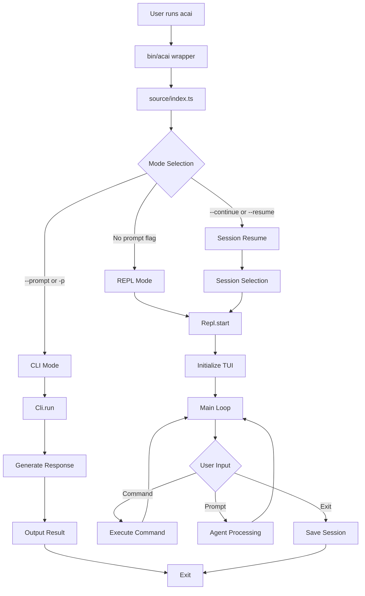
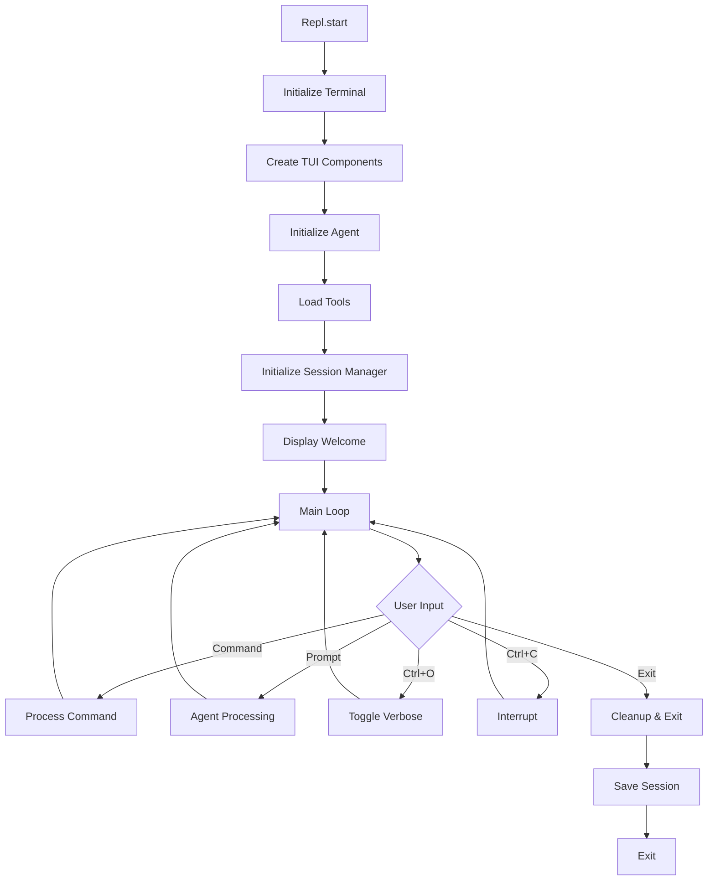
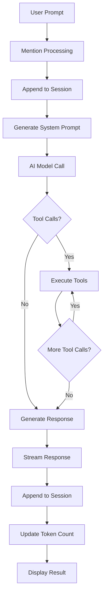
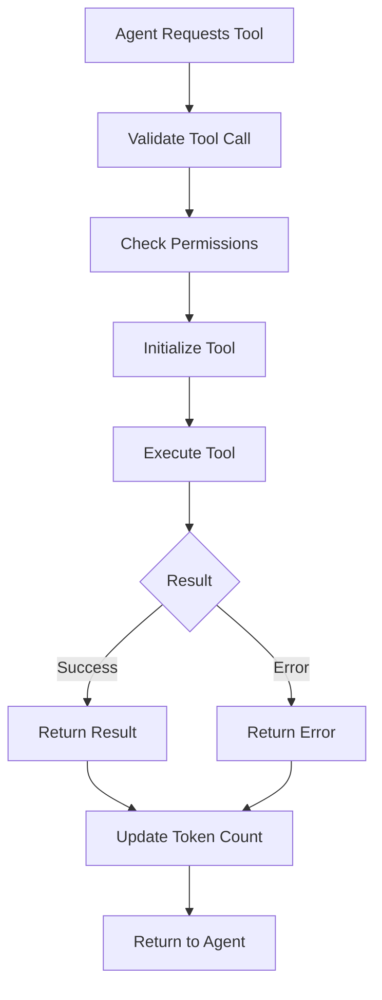
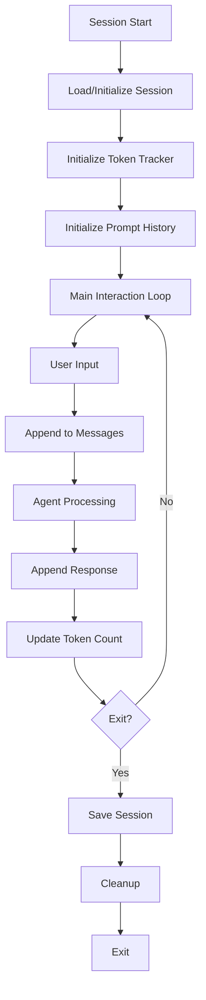
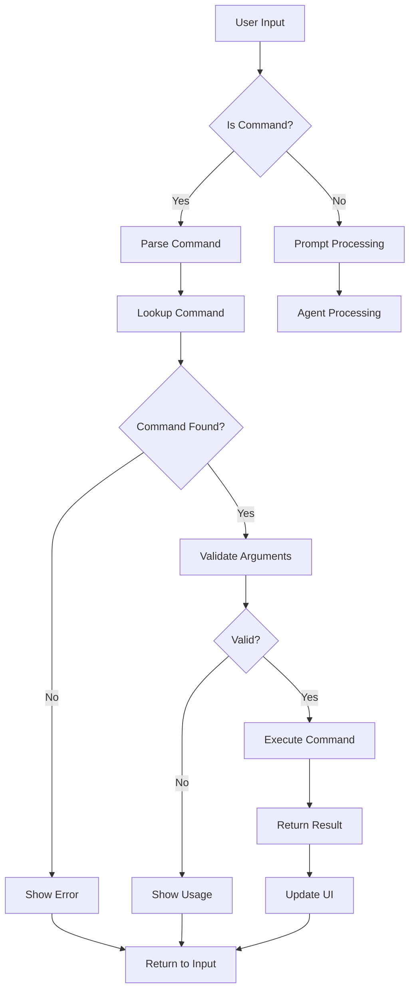
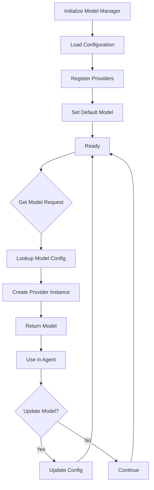
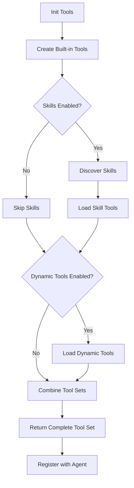
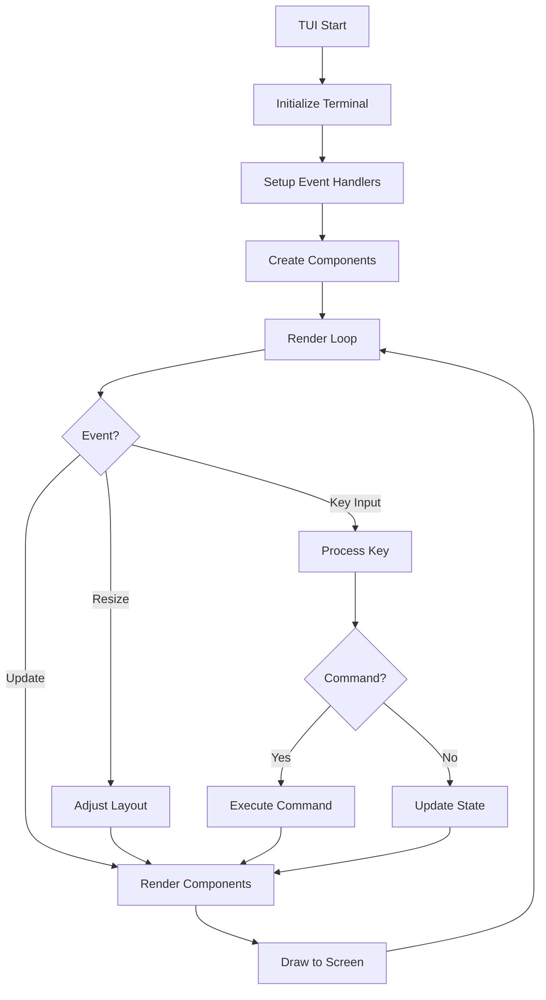
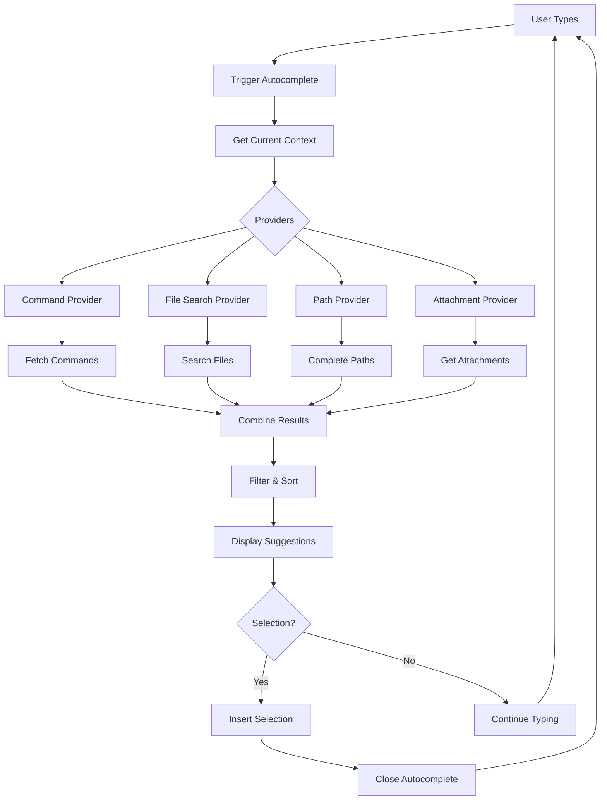

# Acai Architecture

This document outlines the architecture of the Acai CLI tool, an AI-powered command-line assistant for software development. It contains the project structure (excluding dot directories), a comprehensive list of file descriptions, and primary flow diagrams using Mermaid. Updates reflect the current project state as of the latest directory scan.

## Project Structure

```
acai-ts
├── AGENTS.md
├── ARCHITECTURE.md
├── LICENSE
├── README.md
├── TODO.md
├── biome.json
├── commitlint.config.js
├── knip.json
├── package-lock.json
├── package.json
├── plan.md
├── prompt.md
├── docs
│   ├── README.md
│   ├── configuration.md
│   ├── dynamic-tools.md
│   ├── skills.md
│   ├── usage.md
│   ├── adr
│   │   ├── README.md
│   │   ├── index.md
│   │   └── 001-013 architecture decision records
│   └── guardrails
│       ├── api-stability-and-compatibility.md
│       ├── cli-and-user-output.md
│       ├── configuration.md
│       ├── dependencies-build-ci-release.md
│       ├── documentation.md
│       ├── implementation-quality.md
│       ├── performance-and-resource-use.md
│       ├── persistence-and-migrations.md
│       ├── security-and-permissions.md
│       └── testing-and-verification.md
├── scripts
│   └── show-config.ts
├── tsconfig.build.json
├── tsconfig.json
├── bin
│   └── acai
└── source
    ├── agent
    │   └── index.ts
    ├── cli
    │   ├── index.ts
    │   └── stdin.ts
    ├── commands
    │   ├── copy
    │   │   ├── index.ts
    │   │   ├── types.ts
    │   │   └── utils.ts
    │   ├── health
    │   │   ├── index.ts
    │   │   └── utils.ts
    │   ├── help
    │   │   └── index.ts
    │   ├── history
    │   │   ├── index.ts
    │   │   ├── types.ts
    │   │   └── utils.ts
    │   ├── init
    │   │   └── index.ts
    │   ├── init-project
    │   │   ├── index.ts
    │   │   └── utils.ts
    │   ├── list-tools
    │   │   └── index.ts
    │   ├── manager.ts
    │   ├── model
    │   │   ├── index.ts
    │   │   ├── model-panel.ts
    │   │   └── utils.ts
    │   ├── paste
    │   │   ├── index.ts
    │   │   └── utils.ts
    │   ├── resources
    │   │   └── index.ts
    │   ├── session
    │   │   ├── index.ts
    │   │   └── types.ts
    │   ├── share
    │   │   ├── html-renderer.ts
    │   │   └── index.ts
    │   ├── tools
    │   │   ├── index.ts
    │   │   └── templates.ts
    │   └── types.ts
    ├── config
    │   └── index.ts
    ├── execution
    │   └── index.ts
    ├── index.ts
    ├── middleware
    │   ├── audit-message.ts
    │   ├── cache.ts
    │   ├── index.ts
    │   └── rate-limit.ts
    ├── models
    │   ├── ai-config.ts
    │   ├── anthropic-provider.ts
    │   ├── deepseek-provider.ts
    │   ├── google-provider.ts
    │   ├── groq-provider.ts
    │   ├── manager.ts
    │   ├── openai-provider.ts
    │   ├── opencode-go-provider.ts
    │   ├── opencode-zen-provider.ts
    │   ├── openrouter-provider.ts
    │   ├── providers.ts
    │   └── xai-provider.ts
    ├── prompts
    │   ├── manager.ts
    │   ├── mentions.ts
    │   └── system-prompt.ts
    ├── repl
    │   ├── index.ts
    │   └── project-status.ts
    ├── sessions
    │   ├── manager.ts
    │   └── summary.ts
    ├── skills
    │   ├── activated-tracker.ts
    │   └── index.ts
    ├── terminal
    │   ├── ansi-styles.ts
    │   ├── control.ts
    │   ├── default-theme.ts
    │   ├── east-asian-width.ts
    │   ├── formatting.ts
    │   ├── highlight
    │   │   ├── index.ts
    │   │   └── theme.ts
    │   ├── index.ts
    │   ├── keys.ts
    │   ├── markdown-utils.ts
    │   ├── segmenter.ts
    │   ├── select-prompt.ts
    │   ├── string-width.ts
    │   ├── strip-ansi.ts
    │   ├── style.ts
    │   ├── supports-color.ts
    │   ├── supports-hyperlinks.ts
    │   ├── table
    │   │   ├── cell.ts
    │   │   ├── debug.ts
    │   │   ├── index.ts
    │   │   ├── layout-manager.ts
    │   │   ├── table.ts
    │   │   └── utils.ts
    │   └── wrap-ansi.ts
    ├── tokens
    │   ├── counter.ts
    │   └── tracker.ts
    ├── tools
    │   ├── apply-patch.ts
    │   ├── bash.ts
    │   ├── dynamic-tool-loader.ts
    │   ├── edit-file.ts
    │   ├── index.ts
    │   ├── read-file.ts
    │   ├── save-file.ts
    │   ├── skill.ts
    │   ├── think.ts
    │   ├── types.ts
    │   ├── utils.ts
    │   ├── web-fetch.ts
    │   └── web-search.ts
    ├── tui
    │   ├── autocomplete
    │   │   ├── attachment-provider.ts
    │   │   ├── base-provider.ts
    │   │   ├── combined-provider.ts
    │   │   ├── command-provider.ts
    │   │   ├── file-search-provider.ts
    │   │   ├── path-provider.ts
    │   │   └── utils.ts
    │   ├── autocomplete.ts
    │   ├── components
    │   │   ├── assistant-message.ts
    │   │   ├── box.ts
    │   │   ├── editor.ts
    │   │   ├── footer.ts
    │   │   ├── input.ts
    │   │   ├── loader.ts
    │   │   ├── markdown.ts
    │   │   ├── modal.ts
    │   │   ├── notification.ts
    │   │   ├── progress-bar.ts
    │   │   ├── select-list.ts
    │   │   ├── spacer.ts
    │   │   ├── table.ts
    │   │   ├── text.ts
    │   │   ├── thinking-block.ts
    │   │   ├── tool-execution.ts
    │   │   ├── user-message.ts
    │   │   └── welcome.ts
    │   ├── editor-launcher.ts
    │   ├── index.ts
    │   ├── terminal.ts
    │   ├── tui-output.test.ts
    │   ├── tui.ts
    │   └── utils.ts
    └── utils
        ├── bash.ts
        ├── dedent.ts
        ├── filesystem
        │   ├── operations.ts
        │   ├── path-display.ts
        │   └── security.ts
        ├── filetype-detection.ts
        ├── formatting.ts
        ├── funcs.ts
        ├── git.ts
        ├── glob.ts
        ├── ignore.ts
        ├── iterables.ts
        ├── logger.ts
        ├── parsing.ts
        ├── process.ts
        ├── templates.ts
        ├── version.ts
        ├── yaml.ts
        └── zod.ts
└── test
    ├── agent
    ├── commands
    │   ├── copy-command.test.ts
    │   ├── html-renderer.test.ts
    │   ├── health.test.ts
    │   ├── history-command.integration.test.ts
    │   ├── history-command.test.ts
    │   ├── init-project.test.ts
    │   ├── list-tools.test.ts
    │   ├── model.test.ts
    │   ├── paste.test.ts
    │   ├── prompt-command.test.ts
    │   ├── resources-command.test.ts
    │   ├── session-command.test.ts
    │   └── share.test.ts
    ├── config.test.ts
    ├── execution.test.ts
    ├── integration
    ├── mentions.test.ts
    ├── messages.test.ts
    ├── models
    │   ├── ai-config.test.ts
    │   └── manager.test.ts
    ├── sessions
    │   └── manager.test.ts
    ├── skills
    │   └── activated-tracker.test.ts
    ├── setup.js
    ├── stdin-handling.test.ts
    ├── terminal
    │   ├── highlight.test.ts
    │   ├── keys.test.ts
    │   └── markdown-utils.test.ts
    ├── tokens
    ├── tools
    │   ├── bash.test.ts
    │   ├── dynamic-tool-loader.test.ts
    │   ├── edit-file.test.ts
    │   ├── glob.test.ts
    │   ├── grep-enhanced-ux.test.ts
    │   ├── grep-error-handling.test.ts
    │   ├── grep-issue-96.test.ts
    │   ├── grep-match-counting.test.ts
    │   ├── grep-max-results.test.ts
    │   ├── grep.test.ts
    │   ├── ls.test.ts
    │   ├── skill.test.ts
    │   └── web-search.test.ts
    ├── tui
    │   ├── autocomplete.test.ts
    │   ├── components
    │   │   ├── select-list.test.ts
    │   │   └── table.test.ts
    │   ├── modal.test.ts
    │   ├── tool-execution-race-condition.test.ts
    │   └── tool-execution-synthetic-start.test.ts
    └── utils
        ├── bash.test.ts
        ├── filesystem
        │   ├── path-display.test.ts
        │   └── security.test.ts
        ├── filesystem.test.ts
        ├── generators.test.ts
        ├── glob.test.ts
        ├── ignore.test.ts
        ├── mocking.ts
        ├── model-manager.ts
        ├── process.test.ts
        └── test-fixtures.ts
```

## Invariants, Boundaries, and Absences

### Layer Dependencies

Source modules follow a layered dependency rule: modules in one layer may depend
on modules in the same layer or layers below, never upward:

```
┌─────────────────────────────────────────────────────────────┐
│  CLI / REPL / TUI          (orchestration, user-facing)     │
│  ├── source/cli/                                            │
│  ├── source/repl/                                            │
│  └── source/tui/                                             │
├─────────────────────────────────────────────────────────────┤
│  Agent / Commands / Prompts   (interaction logic)           │
│  ├── source/agent/                                           │
│  ├── source/commands/                                        │
│  ├── source/prompts/                                         │
│  └── source/skills/                                          │
├─────────────────────────────────────────────────────────────┤
│  Models / Sessions / Tools / Tokens  (domain abstractions)  │
│  ├── source/models/                                          │
│  ├── source/sessions/                                        │
│  ├── source/tools/                                           │
│  └── source/tokens/                                          │
├─────────────────────────────────────────────────────────────┤
│  Config / Middleware / Execution  (infrastructure)          │
│  ├── source/config/                                          │
│  ├── source/middleware/                                      │
│  └── source/execution/                                       │
├─────────────────────────────────────────────────────────────┤
│  Utils / Terminal               (shared utilities)          │
│  ├── source/utils/                                           │
│  └── source/terminal/                                        │
└─────────────────────────────────────────────────────────────┘
```

- **CLI/REPL/TUI** may import Agent, Commands, Models, Sessions, Tools, Tokens,
  Config, and Utils.
- **Agent** may import Models, Tools, Sessions, Prompts, and Utils — but never
  directly import TUI or CLI modules.
- **Tools** may import Utils and Config only — they must not import Agent,
  Commands, Sessions, or Prompts.
- **Utils** imports only Node built-ins and third-party packages — never other
  source modules. This is the leaf layer.
- **Config** is self-contained and has no source imports beyond Utils.

### Key Absences

- **There is no ORM.** All data persistence uses raw JSON files in
  `~/.acai/sessions/` with no database layer.
- **There is no global state.** Every module receives its dependencies through
  constructors or function arguments. Singletons exist only within the
  `ModelManager` and `ConfigManager` scopes.
- **There is no HTTP server.** Acai is a CLI-only tool — all model API calls go
  outbound through the AI SDK, never inbound.
- **There is no plugin system.** Dynamic tools (`.acai/tools/`) are the
  extensibility mechanism, not a loaded-plugin architecture.
- **There is no generic auth layer.** API key handling is per-provider in
  `source/models/` — no shared authentication middleware exists outside the
  provider implementations.
- **Tools do not have access to the session object.** Sessions are managed by
  `SessionManager` and `source/agent/index.ts`; tool execution receives only
  the context it needs via `ToolExecutionOptions`.
- **There is no cross-provider automatic fallback.** If a provider fails, the
  user must switch models manually (see ADR-007).

### Boundaries

- **Public vs internal**: Each source directory's `index.ts` is the public
  API surface. Modules outside that directory should not import files other
  than the index. The `source/utils/` directory is the exception — its
  functions are importable by name.
- **Config precedence**: `~/.acai/acai.json` < project `.acai/acai.json` <
  CLI flags < environment variables. Later sources win.
- **Session ownership**: Session files are created and managed exclusively by
  `source/sessions/manager.ts`. Other modules (commands, agent) interact with
  sessions through `SessionManager` methods, never by reading session files
  directly.

## File Descriptions

### Root Configuration Files

- **AGENTS.md**: Concise routing guide for agents working in this repository
- **ARCHITECTURE.md**: This file - comprehensive architecture documentation
- **LICENSE**: MIT license for the project
- **README.md**: Project documentation and usage instructions
- **TODO.md**: Outstanding tasks and planned features
- **biome.json**: Biome linting and formatting configuration
- **commitlint.config.js**: Commit message linting configuration
- **knip.json**: Knip dependency and code analysis configuration
- **package.json**: NPM package configuration with scripts and dependencies
- **package-lock.json**: NPM dependency lockfile
- **plan.md**: Project planning documentation
- **prompt.md**: System prompt template
- **tsconfig.json**: TypeScript compiler configuration
- **tsconfig.build.json**: TypeScript build configuration

### Scripts

- **scripts/show-config.ts**: Utility script to display current configuration

### Docs

- **docs/README.md**: Documentation map for users, contributors, and agents
- **docs/configuration.md**: Environment variables, `acai.json`, project settings, and global paths
- **docs/dynamic-tools.md**: Dynamic tool contracts, schema formats, execution protocol, and scaffolding
- **docs/skills.md**: Skills discovery, loading, authoring, and slash-command behavior
- **docs/usage.md**: User guide for CLI, REPL, commands, prompt syntax, and keyboard shortcuts
- **docs/adr/**: Architecture decision records and ADR workflow
- **docs/guardrails/**: Short agent-facing rules organized by compatibility and risk surface

### Bin

- **bin/acai**: Shell wrapper script for the CLI with Node.js compile cache support

### Source - Core

- **source/index.ts**: Main entry point, handles CLI argument parsing and mode selection

### Source - CLI

- **source/cli/index.ts**: CLI mode handler for single-prompt execution
- **source/cli/stdin.ts**: Standard input reading with size limits for piped input

### Source - Config

- **source/config/index.ts**: Configuration management, directory providers, and config schema. Reads AGENTS.md from `~/.acai/AGENTS.md`, `~/.config/AGENTS.md`, and `./AGENTS.md`

### Source - Agent

- **source/agent/index.ts**: Main agent implementation for AI interactions

### Source - Commands

- **source/commands/manager.ts**: Command registration and execution manager
- **source/commands/types.ts**: Shared command type definitions
- **source/commands/copy/**: Command to copy content
- **source/commands/health/**: Command to check system health
- **source/commands/help/**: Command to display help information
- **source/commands/history/**: Command to view conversation history
- **source/commands/init/**: Command to initialize acai configuration
- **source/commands/init-project/**: Command to initialize a new project
- **source/commands/list-tools/**: Command to list available tools
- **source/commands/model/**: Command to manage AI model configuration
- **source/commands/paste/**: Command to paste clipboard content
- **source/commands/resources/**: Command to manage resources
- **source/commands/session/**: Command to manage sessions
- **source/commands/share/**: Command to share conversations
- **source/commands/tools/**: Command to manage dynamic tools (`/tools make`, `/tools list`)

### Source - Models

- **source/models/manager.ts**: Model lifecycle and configuration management
- **source/models/ai-config.ts**: AI model configuration abstraction
- **source/models/providers.ts**: Provider and model type definitions
- **source/models/anthropic-provider.ts**: Anthropic Claude provider
- **source/models/deepseek-provider.ts**: DeepSeek provider
- **source/models/google-provider.ts**: Google Gemini provider
- **source/models/groq-provider.ts**: Groq provider
- **source/models/openai-provider.ts**: OpenAI provider
- **source/models/opencode-go-provider.ts**: OpenCode Go provider
- **source/models/opencode-zen-provider.ts**: OpenCode Zen provider
- **source/models/openrouter-provider.ts**: OpenRouter provider
- **source/models/xai-provider.ts**: xAI Grok provider

### Source - Modes

- **source/modes/manager.ts**: ModeManager class for cycling through specialized modes (Normal, Planning, Research) with mode-specific context prompt injection
- **source/modes/prompts.ts**: Mode-specific prompt templates

### Source - Prompts

- **source/prompts/manager.ts**: Prompt template management and context injection
- **source/prompts/mentions.ts**: Processes #file mentions and paste placeholders in user input
- **source/prompts/system-prompt.ts**: System prompt generation and environment info. Reads AGENTS.md files from three locations: `~/.acai/AGENTS.md` (user-level), `~/.config/AGENTS.md` (global config), and `./AGENTS.md` (project-level)

### Source - REPL

- **source/repl/index.ts**: Interactive REPL mode handler with TUI layout and agent event processing
- **source/repl/project-status.ts**: Git project status display for footer

### Source - Skills

- **source/skills/index.ts**: Skills discovery, validation, loading, and prompt formatting
- **source/skills/activated-tracker.ts**: Tracks activated skills in current session to prevent duplicate loading

### Source - Tools

- **source/tools/index.ts**: Tool initialization and registry
- **source/tools/types.ts**: Tool type definitions including `SessionContext` and `ToolExecutionOptions`
- **source/tools/utils.ts**: Tool utility functions
- **source/tools/bash.ts**: Bash command execution tool
- **source/tools/dynamic-tool-loader.ts**: Dynamic tool loader for loading user-defined tools from `.acai/tools` directories. Supports language-agnostic tools (bash, python, etc.) via shebang/extension detection, Amp-compatible text schema format, `.tool` companion files, and session context passing via environment variables
- **source/tools/edit-file.ts**: File editing tool
- **source/tools/apply-patch.ts**: Apply unified patch format for batch file modifications (supports add, update, delete, and move operations)
- **source/tools/read-file.ts**: File reading tool
- **source/tools/save-file.ts**: File writing tool
- **source/tools/skill.ts**: Skill invocation tool
- **source/tools/think.ts**: Thinking/reasoning tool
- **source/tools/web-search.ts**: Web search tool using Exa API with DuckDuckGo fallback
- **source/tools/web-fetch.ts**: Web content fetch tool with HTML cleaning (Jina AI or local Cheerio-based)

### Source - Terminal

- **source/terminal/terminal.ts**: Terminal interface abstraction
- **source/terminal/control.ts**: Terminal control functions (clear, cursor, etc.)
- **source/terminal/select-prompt.ts**: Interactive selection prompt
- **source/terminal/ansi-styles.ts**: ANSI color and style codes
- **source/terminal/default-theme.ts**: Default terminal theme
- **source/terminal/east-asian-width.ts**: East Asian character width handling
- **source/terminal/formatting.ts**: Terminal formatting utilities
- **source/terminal/keys.ts**: Keyboard key definitions
- **source/terminal/markdown-utils.ts**: Markdown rendering utilities
- **source/terminal/segmenter.ts**: Text segmentation utilities
- **source/terminal/string-width.ts**: String width calculation
- **source/terminal/strip-ansi.ts**: ANSI code removal
- **source/terminal/style.ts**: Terminal styling utilities
- **source/terminal/supports-color.ts**: Color support detection
- **source/terminal/supports-hyperlinks.ts**: Hyperlink support detection
- **source/terminal/wrap-ansi.ts**: ANSI-aware text wrapping
- **source/terminal/highlight/**: Syntax highlighting
- **source/terminal/table/**: Table rendering components

### Source - TUI

- **source/tui/index.ts**: TUI component exports
- **source/tui/tui.ts**: Main TUI controller
- **source/tui/terminal.ts**: Terminal adapter for TUI
- **source/tui/utils.ts**: TUI utility functions
- **source/tui/editor-launcher.ts**: External editor launcher
- **source/tui/autocomplete.ts**: Autocomplete system
- **source/tui/autocomplete/**: Autocomplete providers
- **source/tui/components/**: Reusable TUI components (box, editor, footer, input, loader, markdown, modal, notification, progress-bar, select-list, spacer, table, text, thinking-block, tool-execution, assistant-message, user-message, welcome)

### Source - Utils

- **source/utils/bash.ts**: Bash command utilities
- **source/utils/binary-output.ts**: Binary output detection and handling for Bash tool
- **source/utils/dedent.ts**: Template literal tag for dedenting multi-line strings
- **source/utils/env-expand.ts**: Environment variable expansion for config values
- **source/utils/filetype-detection.ts**: File type detection
- **source/utils/formatting.ts**: Text formatting utilities (files, URLs, code blocks, numbers, dates, durations)
- **source/utils/funcs.ts**: General function utilities
- **source/utils/git.ts**: Git-related utilities
- **source/utils/ignore.ts**: Gitignore-style pattern matching
- **source/utils/iterables.ts**: Iterable utilities
- **source/utils/logger.ts**: Logging infrastructure using Pino
- **source/utils/parsing.ts**: JSON/Zod preprocessing utilities
- **source/utils/process.ts**: Process utilities
- **source/utils/templates.ts**: Argument placeholder substitution for skill/prompt content
- **source/utils/version.ts**: Package version retrieval
- **source/utils/yaml.ts**: YAML parsing utilities
- **source/utils/zod.ts**: Zod schema utilities
- **source/utils/filesystem/**: Filesystem operations and security

### Source - Other

- **source/sessions/manager.ts**: Session lifecycle management
- **source/sessions/summary.ts**: Session exit summary formatting
- **source/tokens/counter.ts**: Token counting utilities
- **source/tokens/tracker.ts**: Token usage tracking
- **source/middleware/**: Middleware for AI interactions (audit, cache, rate-limit)
- **source/execution/**: Command execution handling

### Test

- **test/setup.js**: Test setup and configuration
- **test/agent/**: Agent-related tests
- **test/commands/**: Command tests
- **test/config.test.ts**: Configuration tests
- **test/execution.test.ts**: Execution tests
- **test/integration/**: Integration tests
- **test/mentions.test.ts**: Mention processing tests
- **test/messages.test.ts**: Message handling tests
- **test/models/**: Model management tests
- **test/sessions/**: Session management tests
- **test/stdin-handling.test.ts**: Stdin handling tests
- **test/terminal/**: Terminal utility tests
- **test/tokens/**: Token tracking tests
- **test/tools/**: Tool tests
- **test/tui/**: TUI component tests
- **test/utils/**: Utility function tests

## Flow Diagram

### Main Entry Point Flow


```mermaid
flowchart TD
    A[User runs acai] --> B[bin/acai wrapper]
    B --> C[source/index.ts]
    C --> D{Mode Selection}
    
    D -->|--prompt or -p| E[CLI Mode]
    D -->|No prompt flag| F[REPL Mode]
    D -->|--continue or --resume| G[Session Resume]
    
    E --> H[Cli.run]
    F --> I[Repl.start]
    G --> J[Session Selection]
    J --> I
    
    H --> K[Generate Response]
    K --> L[Output Result]
    L --> M[Exit]
    
    I --> N[Initialize TUI]
    N --> O[Main Loop]
    O --> P{User Input}
    P -->|Command| Q[Execute Command]
    P -->|Prompt| R[Agent Processing]
    P -->|Exit| S[Save Session]
    
    Q --> O
    R --> O
    S --> M
```

### REPL Mode Flow


```mermaid
flowchart TD
    A[Repl.start] --> B[Initialize Terminal]
    B --> C[Create TUI Components]
    C --> D[Initialize Agent]
    D --> E[Load Tools]
    E --> F[Initialize Session Manager]
    F --> G[Display Welcome]
    G --> H[Main Loop]
    
    H --> I{User Input}
    I -->|Command| J[Process Command]
    I -->|Prompt| K[Agent Processing]
    I -->|Ctrl+O| L[Toggle Verbose]
    I -->|Ctrl+C| M[Interrupt]
    I -->|Exit| N[Cleanup & Exit]
    
    J --> H
    K --> H
    L --> H
    M --> H
    N --> O[Save Session]
    O --> P[Exit]
```

### Agent Processing Flow


```mermaid
flowchart TD
    A[User Prompt] --> B[Mention Processing]
    B --> C[Append to Session]
    C --> D[Generate System Prompt]
    D --> E[AI Model Call]
    
    E --> F{Tool Calls?}
    F -->|Yes| G[Execute Tools]
    F -->|No| H[Generate Response]
    
    G --> I{More Tool Calls?}
    I -->|Yes| G
    I -->|No| H
    
    H --> J[Stream Response]
    J --> K[Append to Session]
    K --> L[Update Token Count]
    L --> M[Display Result]
```

### Tool Execution Flow


```mermaid
flowchart TD
    A[Agent Requests Tool] --> B[Validate Tool Call]
    B --> C[Check Permissions]
    C --> D[Initialize Tool]
    
    D --> E[Execute Tool]
    E --> F{Result}
    F -->|Success| G[Return Result]
    F -->|Error| H[Return Error]
    
    G --> I[Update Token Count]
    H --> I
    
    I --> J[Return to Agent]
```

### Session Management Flow


```mermaid
flowchart TD
    A[Session Start] --> B[Load/Initialize Session]
    B --> C[Initialize Token Tracker]
    C --> D[Initialize Prompt History]
    D --> E[Main Interaction Loop]
    
    E --> F[User Input]
    F --> G[Append to Messages]
    G --> H[Agent Processing]
    H --> I[Append Response]
    I --> J[Update Token Count]
    J --> K{Exit?}
    
    K -->|No| E
    K -->|Yes| L[Save Session]
    L --> M[Cleanup]
    M --> N[Exit]
```

### Command Execution Flow


```mermaid
flowchart TD
    A[User Input] --> B{Is Command?}
    B -->|No| C[Prompt Processing]
    B -->|Yes| D[Parse Command]
    
    D --> E[Lookup Command]
    E --> F{Command Found?}
    F -->|No| G[Show Error]
    F -->|Yes| H[Validate Arguments]
    
    H --> I{Valid?}
    I -->|No| J[Show Usage]
    I -->|Yes| K[Execute Command]
    
    K --> L[Return Result]
    L --> M[Update UI]
    
    G --> N[Return to Input]
    J --> N
    M --> N
    C --> O[Agent Processing]
```

### Model Manager Flow


```mermaid
flowchart TD
    A[Initialize Model Manager] --> B[Load Configuration]
    B --> C[Register Providers]
    C --> D[Set Default Model]
    D --> E[Ready]
    
    E --> F{Get Model Request}
    F --> G[Lookup Model Config]
    G --> H[Create Provider Instance]
    H --> I[Return Model]
    
    I --> J[Use in Agent]
    J --> K{Update Model?}
    K -->|Yes| L[Update Config]
    K -->|No| M[Continue]
    
    L --> E
    M --> E
```

### Tool Initialization Flow


```mermaid
flowchart TD
    A[Init Tools] --> B[Create Built-in Tools]
    B --> C{Skills Enabled?}
    
    C -->|Yes| D[Discover Skills]
    C -->|No| E[Skip Skills]
    
    D --> F[Load Skill Tools]
    E --> G{ Dynamic Tools Enabled? }
    
    F --> G
    G -->|Yes| H[Load Dynamic Tools]
    G -->|No| I[Combine Tool Sets]
    
    H --> I
    I --> J[Return Complete Tool Set]
    J --> K[Register with Agent]
```

### TUI Rendering Flow


```mermaid
flowchart TD
    A[TUI Start] --> B[Initialize Terminal]
    B --> C[Setup Event Handlers]
    C --> D[Create Components]
    D --> E[Render Loop]
    
    E --> F{Event?}
    F -->|Key Input| G[Process Key]
    F -->|Resize| H[Adjust Layout]
    F -->|Update| I[Render Components]
    
    G --> J{Command?}
    J -->|Yes| K[Execute Command]
    J -->|No| L[Update State]
    
    H --> I
    K --> I
    L --> I
    
    I --> M[Draw to Screen]
    M --> E
```

### Autocomplete Flow


```mermaid
flowchart TD
    A[User Types] --> B[Trigger Autocomplete]
    B --> C[Get Current Context]
    C --> D{Providers}
    
    D --> E[Command Provider]
    D --> F[File Search Provider]
    D --> G[Path Provider]
    D --> H[Attachment Provider]
    
    E --> I[Fetch Commands]
    F --> J[Search Files]
    G --> K[Complete Paths]
    H --> L[Get Attachments]
    
    I --> M[Combine Results]
    J --> M
    K --> M
    L --> M
    
    M --> N[Filter & Sort]
    N --> O[Display Suggestions]
    O --> P{Selection?}
    P -->|Yes| Q[Insert Selection]
    P -->|No| R[Continue Typing]
    
    Q --> S[Close Autocomplete]
    R --> A
    S --> A
```
